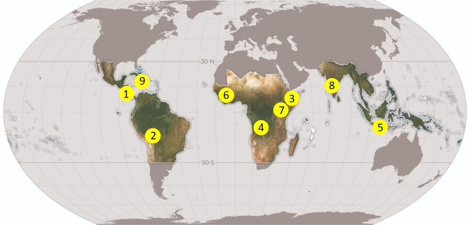
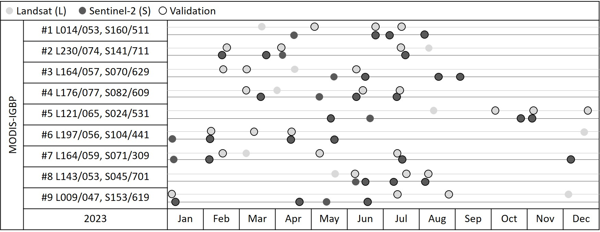
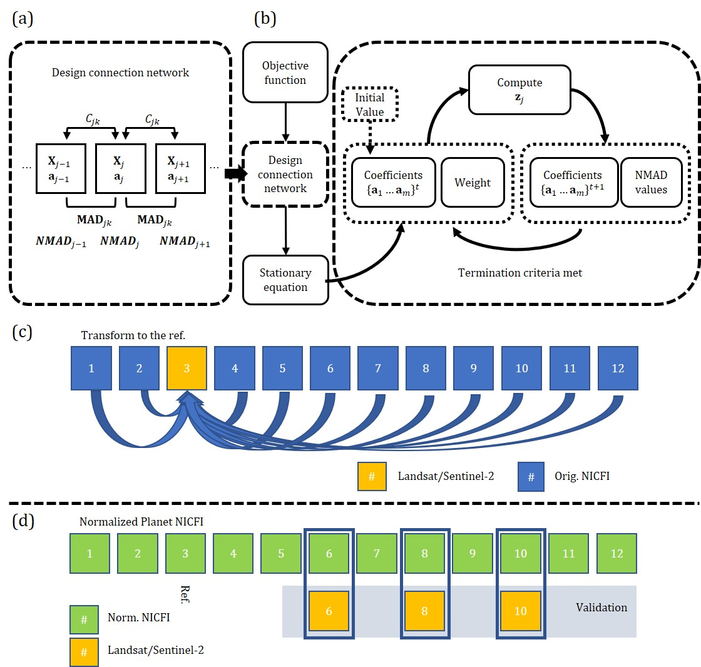

# RGCCA-for-Planet-NICFI

This code is for Re-weighted Regularized Generalized Canonical Correlation Analysis (R-RGCCA) for a paper of Planet-NICFI, authored by Lino Garda Denaro, Ph.D.

---

## 📌 **Dataset Overview**  

### **🛰 Satellite Data**  

- **PLANET NICFI**: Multispectral bands Red, green, blue, and NIR.  

- **Sentinel-2**: Multispectral bands Red, green, blue, and NIR.

- **Landsat-8**: Multispectral bands Red, green, blue, and NIR.

- **Landsat-9**: Multispectral bands Red, green, blue, and NIR.

### **📍 Study Area**  

- **Region**: Land classification by IGBP in Costa Rica - Evergreen Broadleaf Forest (case study)

- **Time Period**: monthly data in 2023.  

### **🏷 Figure of the datasets**  

- Data of IGBP classification

- Data of monthly images

## **Methodology**

- Representation of the method

## **Tutorial: Reading the data of PLANET-NICFI, Landsat-8/-9, and Sentinel-2**

1. Click on the **Code** at **PLANETNICFI.py**

2. Select the images on the **Data** (14 images)

3. Run the Regularized Reweighted Generalized Canonical Correlation Analysis (RRGCCA)

4. Define the Pseudoinvariant Features (PIFs) using dynamic threshold

5. Transform the images using linear regression sequentially to the references.

6. finish

